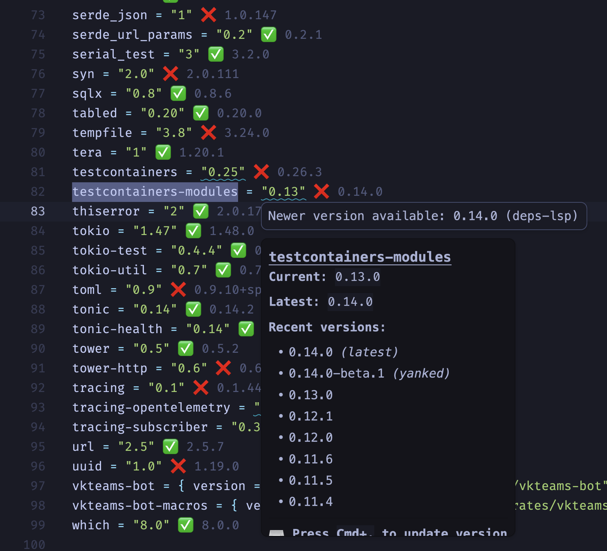

# Deps

[](../../LICENSE)

Zed extension for intelligent dependency management in `Cargo.toml`, `package.json`, and more.



## Features

- **Version Hints** — Inline status indicators (✅ up-to-date, ❌ outdated)
- **Hover Information** — Version list with docs.rs links, features
- **Diagnostics** — Warnings for outdated, yanked, or unknown packages
- **Code Actions** — Quick version updates via `Cmd+.`
- **Autocomplete** — Package names, versions, and feature flags

## Installation

Install **Deps** from Zed Extensions:

1. Open Zed
2. Press `Cmd+Shift+X` to open Extensions
3. Search for "Deps"
4. Click Install

## Configuration

Configure in Zed settings (`Cmd+,`):

```json
{
  "lsp": {
    "deps-lsp": {
      "initialization_options": {
        "inlay_hints": {
          "enabled": true,
          "up_to_date_text": "✅",
          "needs_update_text": "❌ {}"
        },
        "diagnostics": {
          "outdated_severity": "hint",
          "unknown_severity": "warning"
        }
      }
    }
  }
}
```

## Supported Files

| Ecosystem | File | Status |
|-----------|------|--------|
| Rust | `Cargo.toml` | Supported |
| npm | `package.json` | Supported |
| Python | `pyproject.toml` | Planned |

## Development

> [!NOTE]
> This crate compiles to WASM and is distributed via Zed Extensions marketplace.

```bash
# Build WASM extension
cargo build -p deps-zed --target wasm32-wasip1
```

## License

[MIT](../../LICENSE)
