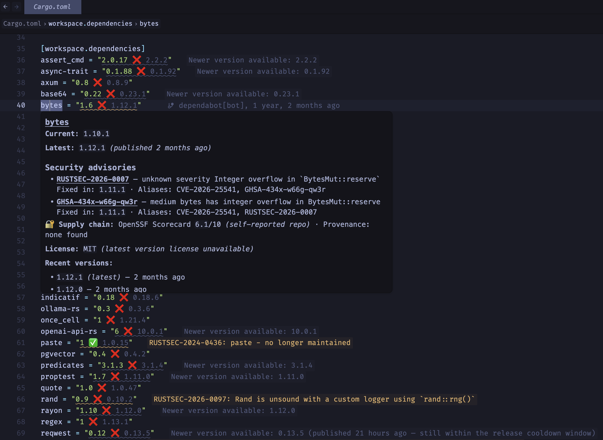

# Deps

[](https://zed.dev/extensions/deps-language-server)
[](LICENSE)

Zed editor extension for [deps-lsp](https://github.com/bug-ops/deps-lsp) — intelligent dependency insights across package ecosystems.



## Features

- **Version Hints** — Inline status indicators (up-to-date / outdated)
- **Hover Information** — Version list with resolved version from lock file
- **Diagnostics** — Warnings for outdated, unknown, yanked, or unsatisfiable-requirement dependencies, plus OSV.dev-backed vulnerability advisories
- **Release-Freshness Signal** — Flags a "latest" version still inside its cooldown window, mirroring GitHub Dependabot's default 3-day package cooldown
- **Code Actions** — Quick fixes via `Cmd+.` to update dependencies, resolve unsatisfiable version requirements, and upgrade to a patched version for known vulnerabilities
- **Code Lens** — "Update N outdated dependencies" batch update on every open manifest
- **Autocomplete** — Package names, versions, and feature flags

## Supported Ecosystems

| Ecosystem | Manifest |
|-----------|----------|
| Rust | `Cargo.toml` |
| Node.js | `package.json` |
| JavaScript / TypeScript (Deno, JSR/npm) | `deno.json`, `deno.jsonc` |
| Python | `pyproject.toml` |
| Go | `go.mod` |
| Ruby | `Gemfile` |
| Dart / Flutter | `pubspec.yaml` |
| GitHub Actions / Docker Compose | YAML files |
| Maven | `pom.xml` |
| Java | build configs |
| Gradle | `build.gradle` |
| Gradle Kotlin DSL | `build.gradle.kts` |
| Swift (SPM) | `Package.swift` |
| PHP (Composer) | `composer.json` |
| C# (NuGet) | `.csproj`, `.fsproj`, `.vbproj`, `Directory.Packages.props` |

> [!NOTE]
> `deps-lsp` also supports Python's `requirements.txt`/`constraints.txt` and NuGet's `packages.config`, but Zed has no built-in language for either file type, so this extension cannot route them to the language server.

## Installation

1. Open Zed
2. Press `Cmd+Shift+X` to open Extensions
3. Search for **Deps**
4. Click Install

## How It Works

The extension launches `deps-lsp` as a language server. On first use, it resolves the binary in this order:

1. Cached path from a previous run
2. System PATH (`deps-lsp` executable)
3. Auto-download from [GitHub releases](https://github.com/bug-ops/deps-lsp/releases) (platform-specific archive)

Old downloaded versions are cleaned up automatically after each update.

## Configuration

Configure in Zed settings (`Cmd+,`):

```json
{
  "inlay_hints": {
    "enabled": true
  },
  "code_lens": "on",
  "diagnostics": {
    "inline": {
      "enabled": true
    }
  },
  "lsp": {
    "deps-lsp": {
      "initialization_options": {
        "inlay_hints": {
          "enabled": true,
          "up_to_date_text": "✅",
          "needs_update_text": "❌ {}"
        },
        "diagnostics": {
          "outdated_severity": "hint",
          "unknown_severity": "warning",
          "yanked_severity": "warning",
          "unsatisfiable_severity": "warning",
          "vulnerabilities_enabled": true
        },
        "freshness": {
          "enabled": true,
          "cooldown_secs": 259200
        },
        "code_lens": {
          "enabled": true
        }
      }
    }
  }
}
```

The top-level `inlay_hints`, `code_lens`, and `diagnostics.inline` are Zed editor settings — off by default — required to actually display hints, the "Update N outdated dependencies" lens, and inline diagnostic messages. The `lsp.deps-lsp.initialization_options` block configures `deps-lsp` itself; see [deps-lsp's configuration reference](https://github.com/bug-ops/deps-lsp#configuration) for the full option list.

## License

[MIT](LICENSE)
